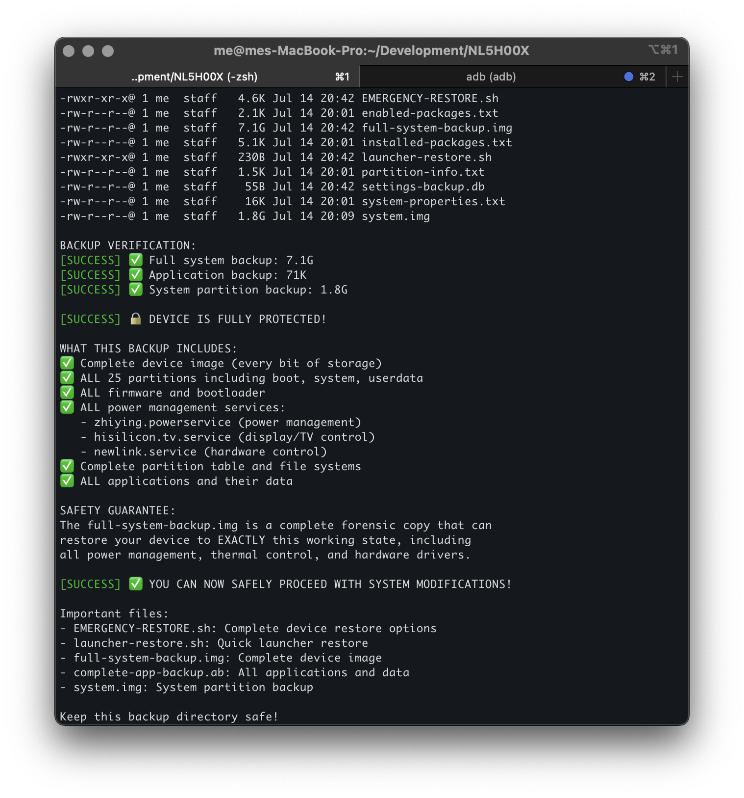

<style>
  .responsive-wrapper {
    display: flex;
    flex-direction: row;
    align-items: flex-start;
    gap: 20px;
  }

  .responsive-wrapper img {
    width: 50%;
  }

  @media (max-width: 768px) {
    .responsive-wrapper {
      flex-direction: column;
    }

    .responsive-wrapper img {
      width: 100%;
    }
  }
</style>

<div class="responsive-wrapper">
  <div style="flex: 1;">
    <h2>Android Projector Toolkit</h2>
    <p>Tools for bypassing security restrictions on locked Android projectors and installing custom launchers.</p>
    <h2>What It Does</h2>
    <p>Fixes Android projectors that won’t let you install apps or change launchers. Creates complete device backup and safely installs Nova Launcher or other custom launchers.</p>
  </div>
  
</div>

## Quick Start

```bash
    # Access hidden features (safe)
    ./scripts/TOOLS.sh

    # Backup device (required before modifications)
    ./scripts/MAKE_BACKUP.sh
```

## Features

- **Hidden Settings Access** - Unlock manufacturer-restricted features
- **Complete Backup** - 7GB+ forensic device image with chunked storage

## Tested Devices

- ✅ Newlink NL5H00X (Android 9)

## Repository Structure

```
    scripts/
    ├── TOOLS.sh                            # Access hidden features
    └── MAKE_BACKUP.sh                      # Complete device backup  
    projector-backup-<DATESTAMP>/           # Auto-generated backup directory  
    docs/                                   # Detailed guides
    apks/                                   # Launcher files
    assets/                                 # Console demo
```

## Safety

- ⚠️ **Backup required** - Script won’t run without complete backup
- ⚠️ **Root needed** - Requires existing root access  
- ⚠️ **Voids warranty** - Use at own risk

## Emergency Recovery

```bash
# Reset launcher
adb shell cmd package set-home-activity com.newlink.hisilauncher

# Full restore
./scripts/RESTORE.sh
```

## License

MIT License - Educational use only.
