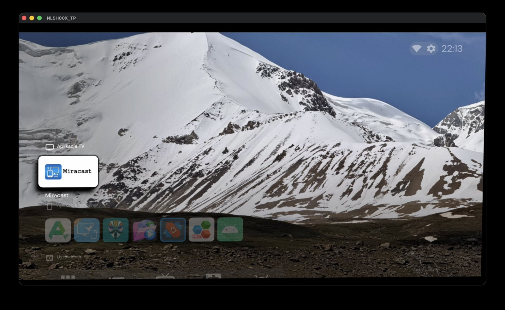

# Android Projector Toolkit

Tools for bypassing security restrictions on locked Android projectors and installing custom launchers.

## Table of Contents

- [Overview](#overview)
- [Quick Start](#quick-start)
- [Unlocking the launcher](#unlocking-the-launcher)
- [Installing apps](#installing-apps)
- [Root for apps](#root-for-apps)
- [Features](#features)
- [Scripts](#scripts)
- [Documentation](#documentation)
- [Tested Devices](#tested-devices)
- [Safety](#safety)
- [If the projector stops booting: the `wtprovision` brick](#if-the-projector-stops-booting-the-wtprovision-brick)
- [Emergency Recovery](#emergency-recovery)
- [Contributing](#contributing)
- [License](#license)

## Overview

Fixes Android projectors that won't let you install apps or change launchers. Creates a complete device backup and safely replaces the locked stock launcher with [Projectivy](https://github.com/spocky/miproja1), or another launcher of your choice.

## Quick Start

```bash
./scripts/PROJECTOR.sh
```

That is the whole thing. It finds the projector, shows what state it is in, and
walks you through backup → verify → unlock, with a progress bar for the 15-minute
backup. Nothing is done without asking.

```
  NL5H00X Projector Toolkit
  -----------------------------------------------------------
  device       NL5H00X_TP   root: yes
  backup       verified  7.65 GB   projector-backup-20260728_054611
  launcher     locked     stock launcher
  -----------------------------------------------------------

  [1] Back up the device again  ~13 min
  [2] Unlock the launcher
  [3] Restore the stock launcher
  [4] Detailed unlock state
  [5] Refresh
  [q] Quit

  > 1
```

The backup runs behind a live view rather than fifteen minutes of nothing:

```
  Backing up  NL5H00X_TP
  -----------------------------------------------------------
  [########################................]  62%

  pulled     4.74 GB / 7.65 GB
  block      18 of 29
  rate       10.4 MB/s   4 min left
  stalls     3 killed and retried  expected on this device
  -----------------------------------------------------------
  [INFO]   56%  4.28 GB / 7.65 GB
  [WARN] Transfer stalled 30s at 4.41 GB - killing it
  [WARN] Block at 4.41 GB: got 113156093 bytes, wanted 268435456 (try 1/3)
  [INFO]   62%  4.74 GB / 7.65 GB

  the backup keeps running even if you close this
```

`stalls killed` is normal on this hardware, not a warning sign — the remote
`dd` gets reaped periodically and each block is simply retried. A run that
shows three of them still produces a byte-exact image.

The individual scripts still work on their own if you prefer them, or want to
script against them:

```bash
./scripts/TOOLS.sh               # hidden settings screens, plus the root tools
./scripts/MAKE_BACKUP.sh         # full device image, resumable
./scripts/UNLOCK.sh --status     # what is applied; changes nothing
./scripts/UNLOCK.sh --apply-all
```

## Unlocking the launcher

The projector ships locked to `com.newlink.hisilauncher` and will not let you
change the home screen from Settings. `UNLOCK.sh` fixes that.

```bash
./scripts/UNLOCK.sh              # interactive menu
./scripts/UNLOCK.sh --status     # what is and is not applied; changes nothing
./scripts/UNLOCK.sh --apply-all  # do everything, then stop
./scripts/UNLOCK.sh --revert     # put the stock launcher back
```

Getting a launcher onto the device is two problems, not one: the APK has to be
installed, and it has to win the home intent. **Change the launcher with a
preference, never by disabling the stock one.**

This firmware does not dispatch the ordinary home intent. It adds a second
category — `MAIN` + `HOME` + **`SETUP_WIZARD`** — and the only component that
declares `SETUP_WIZARD` is `com.newlink.wtprovision/.MainActivity`. That
component wins the home intent uniquely and then starts `com.newlink.hisilauncher`
by explicit component name. The stock launcher never wins HOME on its own; it is
*started by* wtprovision. Disable wtprovision and the home intent has zero
candidates, and the device stops booting — see
[docs/BOOT_DEADLOCK.md](docs/BOOT_DEADLOCK.md).

So leave `wtprovision` enabled. It stays as the fallback, so a preference that
ever goes stale degrades to "boots to the stock launcher" instead of "does not
boot".

The reliable route is the system's own chooser: with a second launcher installed,
press HOME and pick it, choosing **Always**. Android writes a preference recorded
against the *real* intent — the one carrying `SETUP_WIZARD` — with the correct
candidate set. `pm set-home-activity` is weaker: it reports `Success` without
recording a preference that covers that intent, so HOME keeps showing the chooser.

Verify before rebooting. This must name your chosen launcher, not `No activity found`:

```bash
adb shell 'su 0 pm resolve-activity --brief \
  -a android.intent.action.MAIN \
  -c android.intent.category.HOME \
  -c android.intent.category.SETUP_WIZARD'
```

Projectivy running as the home screen after a clean boot, with `wtprovision`
left enabled:



What it does, one step at a time — each is checked by reading the value back
off the device, not by trusting the command's exit code:

| Step | Change |
|------|--------|
| `dev_options` | Developer options on, install from unknown sources allowed |
| `launcher_present` | Projectivy installed (skipped if you already have it) |
| `launcher_default` | Projectivy set as home via the system home preference; nothing is disabled |
| `cleanup_leftovers` | Removes empty/duplicated folders from earlier attempts |

Safety behaviour worth knowing:

- Refuses to run on anything that is not an NL5H00X.
- Refuses to change anything without a verified backup (`--status` is exempt).
- Re-running it is a no-op; it reports what was already done.
- **Nothing is ever disabled.** The stock launcher and `wtprovision` are both
  left enabled, so the worst a stale preference can do is fall back to the stock
  home — never no home at all.
- It refuses to write a launcher preference while an interceptor still owns the
  home intent, rather than leaving you with a preference the firmware ignores.
- `--revert` clears the preference and puts the stock home back, and that too is
  verified by reading the resolved home activity off the device.

Restart the projector afterwards for the new home screen to appear.

### Why Projectivy

The projector is driven by a remote, not a touchscreen. Projectivy is a
leanback launcher: it declares `LEANBACK_LAUNCHER`, lays out for a D-pad, and
is built for exactly this class of device. Nova — which an earlier attempt left
sitting in `/system/app` — is a phone launcher, workable with a mouse and
awkward with the remote that comes in the box.

The APK is taken from the developer's own GitHub releases rather than a mirror,
and its package, SDK range, ABIs and signing certificate are recorded in
[`apks/PROVENANCE.md`](apks/PROVENANCE.md). If you already installed Projectivy
from Google Play, keep it — `launcher_present` sees it and does nothing.

Nothing hardcodes Projectivy. To use a different launcher:

```bash
LAUNCHER_PKG=com.teslacoilsw.launcher \
LAUNCHER_NAME=Nova \
LAUNCHER_APK_GLOB='nova-launcher*.apk' \
  ./scripts/UNLOCK.sh --apply-all
```

The home activity is never hardcoded either — it is resolved off the device by
asking which component actually handles `CATEGORY_HOME`, so a launcher that
renames its activity between releases does not break anything.

## Installing apps

This projector refuses every normal install. `adb install`, a session install,
a local `pm install`, `-f`, and the same commands as root all fail with
`INSTALL_FAILED_INVALID_INSTALL_LOCATION`, with sideloading enabled, no
restrictions and gigabytes free. `/data/app` is empty — nothing has ever been
installed the normal way. The failure is an exception inside the vendor's patched
`PackageManagerService`, not a capacity decision, and it is not something a flag
works around. [docs/INSTALL_LOCKED.md](docs/INSTALL_LOCKED.md) records everything
that was ruled out.

The way in is `/system/app`. `INSTALL_APP.sh` does it properly:

```bash
./scripts/INSTALL_APP.sh SmartTube_stable_31.94_armeabi-v7a.apk
./scripts/INSTALL_APP.sh app.apk --name MyApp --no-reboot
./scripts/INSTALL_APP.sh --remove org.smarttube.stable
```

It tries a normal install first, then falls back to `/system/app`. It picks the
device's ABI off `ro.product.cpu.abilist` and refuses an APK built for the wrong
one — this device is 32-bit `armeabi-v7a` only. It **unpacks the native
libraries** into `lib/<isa>/`, which a plain copy does not: an app whose manifest
leaves `extractNativeLibs` at its default ships compressed `.so` files that
nothing extracts, and it then dies at the first `System.loadLibrary`. It verifies
the APK and every library by checksum, returns `/` to read-only, and after the
reboot checks that the package registered and its ABI resolved.

Two things worth knowing:

- The app only registers on the **next boot**, and it becomes a system app —
  removing it means `--remove`, not the launcher.
- Installing any app that declares a `LAUNCHER` category makes Android clear the
  recorded home preference, so HOME shows the chooser again afterwards. Set your
  launcher default **after** installing apps, not before.

`INSTALL_APP.sh` reads the manifest and **refuses any APK that declares
`CATEGORY_HOME` or `SETUP_WIZARD`** unless you pass `--allow-home`. Getting the
home intent wrong is what bricks this device.

## Root for apps

The shell is already root here: `su 0 id` returns uid 0 and everything above
depends on it. An **app** is a different problem. Zygote sets
`PR_SET_NO_NEW_PRIVS` on every app process, and with that flag the kernel
ignores the setuid bit, so no `su` binary an app execs can ever elevate it.
Magisk does not fill the gap either: both `boot` and `recovery` carry
`ramdisk=0` in their Android headers, so `magiskboot unpack` finds nothing to
inject into. [root/README.md](root/README.md) has the measurements.

What works is a daemon that is already root. `sud` listens on an abstract Unix
socket, reads the caller's uid from `SO_PEERCRED` (kernel-supplied, not
spoofable), resolves it to a package, and checks it against an allow-list. An
allowed caller gets a forked child running as root on its own stdin/stdout/stderr.
An unlisted caller, or no list at all, is refused. It fails closed, because
failing open roots every app on the device.

`ROOT.sh` installs that daemon so it survives a reboot:

```bash
./scripts/ROOT.sh                              # interactive menu
./scripts/ROOT.sh --status                     # what is applied; changes nothing
./scripts/ROOT.sh --apply-all                  # daemon, init service, allow-list
./scripts/ROOT.sh --allow com.spocky.projengmenu
./scripts/ROOT.sh --deny  com.spocky.projengmenu
./scripts/ROOT.sh --revert                     # remove all of it
```

It needs the binaries built first, and this device is 32-bit `armeabi-v7a` only:

```bash
NDK=/path/to/android-ndk ./root/build.sh
```

`ROOT.sh` reads them from `root/` by default; point `ROOT_ARTIFACT_DIR` elsewhere
if you build somewhere else.

| Step | Change |
|------|--------|
| `daemon_binary` | `sud` installed to `/system/xbin/sud`, verified by hash |
| `daemon_service` | init service at `/system/etc/init/sud.rc` so `sud` starts at boot |
| `allow_list` | `/data/adb/su-allow`, mode 0600, root-only so an app cannot list itself |
| `su_hybrid` | **opt-in, `--with-su`**: replaces `/system/xbin/su`, keeping the stock one as `su_orig` |

Same contract as `UNLOCK.sh`: it refuses anything that is not an NL5H00X,
refuses to change anything without a verified backup (`--status` is exempt),
reads every change back off the device instead of trusting an exit code, and
re-running it is a no-op.

**`sud` only comes up on the next boot.** Reboot, watch the screen, then
`./scripts/ROOT.sh --status` confirms the daemon over adb.

### The seclabel, and why this cannot brick the device

On Android 9, init refuses to start a service whose executable has no
policy-defined domain transition, and it refuses *before* fork. That is a policy
computation, not an AVC decision, so SELinux Permissive does not bypass it: the
service needs a `seclabel` naming a domain the device actually has. `sud.rc`
asks for `u:r:su:s0`, which exists on this userdebug firmware. Override it with
`--seclabel` and name a domain the policy does not define, and init refuses to
start that one service while **boot still completes**. The failure mode is an
absent daemon, not a dead projector. That is the whole reason the default path
is safe to try:

```bash
./scripts/ROOT.sh --repair    # sud not running after a reboot? diagnose why
```

`--repair` also prints the serial-console equivalent of every step, for a device
that is not answering adb.

### What you can do once root works

The ROOT section of `./scripts/TOOLS.sh` is the menu over all of this. It shows
the current root state, grants or revokes an app's root, runs a single command as
uid 0, copies a root-only file off the device with a hash check, turns ADB over
Wi-Fi on and off, and freezes or unfreezes apps.

```bash
./scripts/TOOLS.sh            # ROOT -> Root status
su 0 cat /data/system/packages.list          # /data is root-only
su 0 pm disable-user --user 0 com.apkpure.aegon   # freeze a vendor app
su 0 setprop service.adb.tcp.port 5555       # then: adb connect <ip>:5555
su 0 mount -o remount,rw /                   # /system lives on / here
```

Note the form: this device takes `su <uid> <command>`. `su -c 'id'` answers
`invalid option -- c`.

Two things to know before using any of it. **Never freeze
`com.newlink.wtprovision`** — it owns the boot intent on its own and freezing it
stops the boot before adb comes up (`TOOLS.sh` refuses it). And root does **not**
lift the install lock: `pm install` still fails, apps still go to `/system/app`.

[root/README.md](root/README.md) has the worked examples, including reading an
app's database, dumping a partition and what an allow-listed app can actually do.

### The hybrid su is the risky part

`--with-su` replaces `/system/xbin/su`, which is the channel the rest of this
toolkit runs on. Getting it wrong costs you root over adb. It is off by default,
and when you do ask for it the script stages the new binary to a separate path,
runs a live `su 0 id` through that path before promoting it, hash-verifies the
promotion, re-checks the root channel afterwards, and never deletes the
preserved stock `su_orig`. `--revert` puts the stock `su` back and verifies the
hashes match.

## Features

- **App installation** - Install APKs on a device whose package manager refuses every normal install
- **Root for apps** - A socket daemon that gives allow-listed apps root, started at boot by its own init service
- **Hidden Settings Access** - Unlock manufacturer-restricted features without modifications
- **Complete Backup** - 7GB+ forensic device image with chunked storage support
- **Custom Launcher** - Replace the locked stock launcher with Projectivy, Nova, or another launcher (requires root)

## Scripts

| Script | Purpose | Root Required |
|--------|---------|---------------|
| [`PROJECTOR.sh`](scripts/PROJECTOR.sh) | **Start here** — guided interface over everything below | Depends |
| [`TOOLS.sh`](scripts/TOOLS.sh) | Open hidden settings screens, reset the home screen, and the ROOT tools | Only the ROOT section |
| [`MAKE_BACKUP.sh`](scripts/MAKE_BACKUP.sh) | Create complete device backup | Yes |
| [`UNLOCK.sh`](scripts/UNLOCK.sh) | Replace the locked stock launcher | Yes |
| [`INSTALL_APP.sh`](scripts/INSTALL_APP.sh) | Install an APK the device otherwise refuses | Yes |
| [`ROOT.sh`](scripts/ROOT.sh) | Install the `sud` root daemon so apps can get root, persistently | Yes |

## Documentation

| Document | Description |
|----------|-------------|
| [Technical Notes](docs/TECHNICAL_NOTES.md) | Device analysis, ADB commands, partition layout |
| [Boot Branding](docs/BOOT_BRANDING.md) | Replacing the U-Boot logo and the boot animation — formats, the ~7 fps ceiling, the silent `adb push` trap |
| [Boot Deadlock](docs/BOOT_DEADLOCK.md) | The `wtprovision` brick — mechanism, diagnosis, recovery |
| [Install Lock](docs/INSTALL_LOCKED.md) | Why normal installs fail, and the `/system/app` workaround |
| [Developer Options](docs/DEV_OPTIONS_CRASH.md) | Why the Developer options screen crashes, and the AOSP platform key that makes patching it possible |
| [Root for apps](root/README.md) | Why setuid `su` cannot root an app here, the socket daemon that can, and how it is made persistent |
| [Security Analysis](docs/SECURITY_ANALYSIS.md) | Detailed security restriction analysis |
| [Docs README](docs/README.md) | Documentation overview |

## Tested Devices

| Device | Android | Status |
|--------|---------|--------|
| Newlink NL5H00X | 9 | Tested |

## Repository Structure

```
scripts/
  PROJECTOR.sh          # Guided interface -- start here
  TOOLS.sh              # Access hidden features, plus the root tools
  MAKE_BACKUP.sh        # Complete device backup
  UNLOCK.sh             # Launcher unlock, interactive CLI
  INSTALL_APP.sh        # Install an APK via /system/app fallback
  ROOT.sh               # Persistent root: sud daemon, init service, allow-list
  lib/
    common.sh           # Shared functions
    unlock.sh           # Unlock steps (state/apply/revert per step)
    root.sh             # Root steps, same four-function contract
root/
  sud.c                 # The root daemon
  su.c, suc.c           # Hybrid su and the PoC client
  suclient.c/.h         # Wire protocol shared by both clients
  privtest.c            # Diagnostic: sets NO_NEW_PRIVS, then execs
  sud.rc                # init service that starts sud at boot
  build.sh              # Builds everything for armeabi-v7a
tests/
  run-tests.sh          # Backup regression suite
  unlock-tests.sh       # Unlock end-to-end suite
  root-tests.sh         # Persistent-root end-to-end suite
  ui-tests.sh           # TOOLS.sh and PROJECTOR.sh front ends
  fake-adb/adb          # Emulated projector -- no hardware needed
  device-emu/seed.sh    # Seeds the emulator from measured firmware values
docs/
  TECHNICAL_NOTES.md    # Technical documentation
  BOOT_DEADLOCK.md      # The wtprovision brick and its recovery
  INSTALL_LOCKED.md     # Why installs fail and the /system/app workaround
  SECURITY_ANALYSIS.md  # Security analysis
  README.md             # Docs overview
apks/
  projectivy-launcher-4.71.apk   # installed by default
  nova-launcher-7.0.57.apk       # fallback, via LAUNCHER_* overrides
  PROVENANCE.md                  # where each came from and what was verified
assets/
  img1.png              # Console demo
  hardware/             # Board and UART photos, referenced from the docs
```

## Safety

- **Backup required** - Modification scripts require complete backup first
- **Root needed** - System modifications require existing root access
- **Voids warranty** - Use at your own risk

## If the projector stops booting: the `wtprovision` brick

**Never disable `com.newlink.wtprovision/.MainActivity`.** It is not a launcher and
it is not optional. Disabling it stops this projector from booting, and it takes
every remote channel down with it. This is the single most destructive thing you
can do to an NL5H00X short of writing a bad image.

### Why it bricks

This firmware does not dispatch the ordinary home intent. It adds a second
category:

```
act=android.intent.action.MAIN
cat=[android.intent.category.HOME, android.intent.category.SETUP_WIZARD]
```

Exactly one component on the device declares `SETUP_WIZARD` alongside `HOME`:
`com.newlink.wtprovision/.MainActivity`. It wins the home intent uniquely and then
starts `com.newlink.hisilauncher` by explicit component name. That is the vendor's
designed boot path — the stock launcher is *started by* wtprovision, it does not
win HOME on its own.

Disable that one component and `ActivityManagerService.systemReady()` logs:

```
E ActivityManager: No home screen found for Intent { act=android.intent.action.MAIN
    cat=[android.intent.category.HOME,android.intent.category.SETUP_WIZARD] flg=0x100 }
```

and then deadlocks:

> no home activity resolves → no activity ever starts → nothing ever goes idle →
> `finishBooting()` is never called → `sys.boot_completed` is never set → user 0
> stays in `BOOTING` → components of non-direct-boot-aware apps stay filtered out
> of resolution → still no home.

`android.intent.category.SETUP_WIZARD` is also why Android's own `FallbackHome`
cannot rescue the boot by itself: `FallbackHome` declares `HOME` but not
`SETUP_WIZARD`, so it does not match the intent the firmware actually sends.

### Why you lose every channel at once

All of these are consequences of the same stall, not separate faults:

| Symptom | Cause |
|---|---|
| Stuck on the vendor logo forever | `bootanim` exits; the last frame is left on screen. It is frozen, not loading. |
| No Wi-Fi | The network stack never brings up saved networks because boot never completes. |
| No adb over network | Follows from the above. |
| No adb over USB | The chassis USB-A ports are **host** ports. A host cannot enumerate to your PC. The device-side USB footprint on the board is unpopulated. |
| Recovery unreachable | On the units seen so far, U-Boot accepts `reboot recovery` (`starting system with command 'recovery'`) and then boots the normal Android image anyway — there is no usable recovery partition. |

A device in this state still runs: `system_server` is alive, Bluetooth works, and
a serial console will give you a root shell. It looks dead and is not.

### Recovering it

If the device still answers adb, the toolkit does it for you:

```bash
./scripts/UNLOCK.sh --repair
```

It skips the usual device and backup checks on purpose — this failure leaves
neither — and with nothing on adb it prints the serial commands instead.

Otherwise you need the UART console. On the `NL-5H000-MAIN-V1` board the pads are two plated
through-holes labelled `TX RX` on the silkscreen, immediately to the right of the
4-pin speaker connector (`VOR+ VOR- VOL- VOL+`). There is no ground pad next to
them — take `GND` from the keypad connector (`LED-G LED-R KEY0-IN2 KEY0-IN1 GND`).
**115200 8N1**, no flow control, 3.3 V logic. You get `console:/ $`.

Root uses Android's `su`, not the GNU form:

```bash
su 0 id          # works
su -c id         # fails: "su: invalid uid/gid '-c'"
```

**Permanent fix — one command:**

```bash
su 0 pm enable com.newlink.wtprovision/.MainActivity
```

Verify before rebooting. This must return `wtprovision`, not "No activity found":

```bash
su 0 pm resolve-activity --brief \
  -a android.intent.action.MAIN \
  -c android.intent.category.HOME \
  -c android.intent.category.SETUP_WIZARD
```

**If you need the screen back before you fix it**, start Android's fallback home
explicitly. This breaks the deadlock for the current boot: an activity finally
starts, boot completes, the user unlocks, Wi-Fi and adb come back.

```bash
su 0 am start -n com.android.tv.settings/.system.FallbackHome
```

Do not expect `am start` on a launcher to work while the device is stuck. During
`BOOTING`, component resolution is filtered and both
`com.newlink.hisilauncher/.MainActivity` and `.WizardAciticity` answer
`Activity class ... does not exist`, even though `pm list packages` shows the
package installed. Check `su 0 dumpsys user | grep -i State` first — if it reads
`BOOTING`, only a direct-boot-aware component such as `FallbackHome` can be
started.

### Diagnosing it yourself

`pm list packages -d` lists disabled **packages** and will show nothing here — the
package is enabled and only one **component** is disabled. Ask the right question:

```bash
su 0 dumpsys package com.newlink.wtprovision | grep -A3 disabledComponents
```

Boot progress markers tell you how far the system got. A healthy boot ends with
`boot_progress_enable_screen`; this brick stops right after
`boot_progress_ams_ready`:

```bash
su 0 logcat -d -b events | grep boot_progress
```

Note that `load average` near 8.0 with no process using CPU is **normal** on this
SoC — those are HiSilicon kernel monitor threads parked in uninterruptible sleep.
It is not evidence of failing storage.

## Emergency Recovery

```bash
# Put the stock launcher back (the supported way -- it verifies the result)
./scripts/UNLOCK.sh --revert

# By hand, if you cannot run the script. This writes the home preference back
# to the stock launcher; the chooser route (press HOME, pick it, Always) is the
# reliable one on this firmware.
#
# The component is .WizardAciticity, spelled exactly like that in the firmware.
# .MainActivity is the screen you actually see, but it carries no HOME filter,
# so set-home-activity rejects it. Ask the device rather than trusting either:
adb shell 'echo "pm enable com.newlink.hisilauncher" | su'
adb shell cmd package query-activities --brief \
  -a android.intent.action.MAIN -c android.intent.category.HOME
adb shell cmd package set-home-activity com.newlink.hisilauncher/.WizardAciticity
```

Full restore from the image is a different matter. `RESTORE.sh` is **generated
by `MAKE_BACKUP.sh` into the backup directory** -- it is not in `scripts/` --
so run it from there:

```bash
cd projector-backup-<timestamp>/
./RESTORE.sh
```

It refuses to write a full-device image that does not match `backup-manifest.txt`,
and refuses outright if the manifest is missing. Restoring a short image over
the whole device is how a projector stops booting.

## Development without a projector

The whole toolkit runs against an emulated device, so changes can be tested
without touching hardware — which matters when the thing under test is "the
backup you would restore from" or "the launcher you need to boot".

```bash
bash tests/run-tests.sh      # backup suite
bash tests/unlock-tests.sh   # unlock suite
bash tests/root-tests.sh     # persistent-root suite
bash tests/ui-tests.sh       # TOOLS.sh and PROJECTOR.sh
```

The UI suite runs the front ends through `/bin/bash` rather than whatever
`bash` resolves to on `$PATH`, because that is what the shebang picks. macOS
still ships bash 3.2, and testing against a newer bash from Homebrew hid a
`local -n` that broke `TOOLS.sh` outright for every Mac user.

The emulator is seeded from values measured on a real NL5H00X: its
`build.prop`, its `/system/app` inventory, piped-`su` only (`su -c` is
rejected, as on the device), `/system` mounted read-only, and the
`SETUP_WIZARD` home dispatch that makes `wtprovision` the sole home candidate.
For the root suite it also models init-service liveness, so a `sud.rc` with a
seclabel the policy does not define produces an absent daemon after a reboot,
exactly as on the device.
It **refuses what the device refuses**, so an unlock that forgets to remount
`/system`, or writes a home preference the firmware ignores, fails there too.

To drive the scripts against your own pulled firmware instead of the stand-in:

```bash
export FAKE_ADB_STATE=/tmp/fakedev
mkdir -p "$FAKE_ADB_STATE/sdcard"
cp projector-backup-*/full-system-backup.img "$FAKE_ADB_STATE/blockdev"
PATH="$PWD/tests/fake-adb:$PATH" ./scripts/TOOLS.sh
```

## Contributing

See [CONTRIBUTING.md](CONTRIBUTING.md) for guidelines.

## License

[MIT License](LICENSE) - Educational use only.
