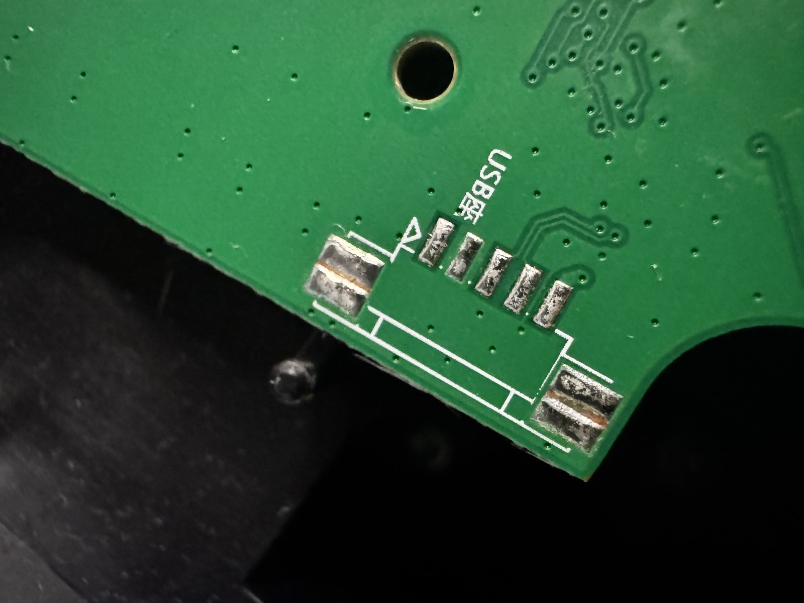
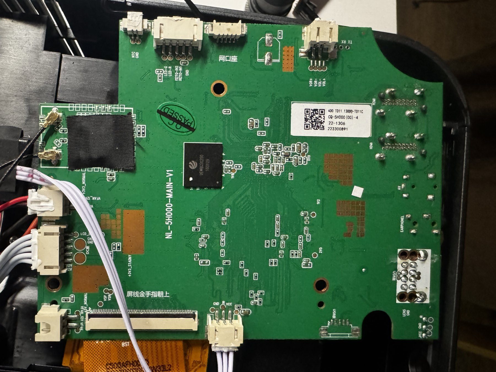
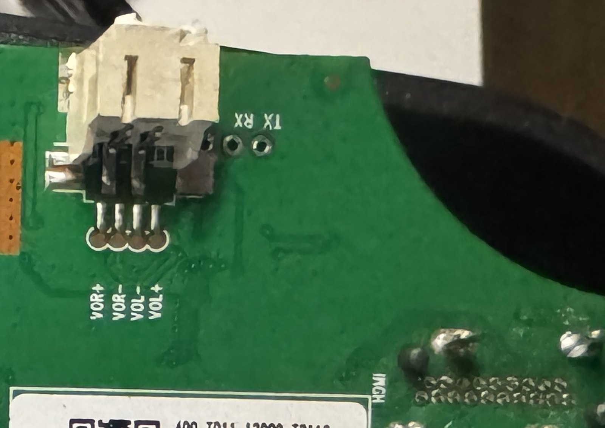

# Boot deadlock: the `wtprovision` brick

How disabling one Android component stops an NL5H00X from booting, why it takes
every remote channel down with it, how to diagnose it, and the one-command fix.

Written after bricking a projector this exact way and recovering it over a
soldered UART console.

---

## Summary

| | |
|---|---|
| **Trigger** | `pm disable com.newlink.wtprovision/.MainActivity` |
| **Symptom** | Stuck on vendor logo forever. No Wi-Fi, no adb, no recovery. |
| **Actual state** | System running. `system_server` alive, Bluetooth works, serial console gives root. |
| **Fix** | `su 0 pm enable com.newlink.wtprovision/.MainActivity` |
| **Unstick current boot** | `su 0 am start -n com.android.tv.settings/.system.FallbackHome` |
| **Requires** | UART console, unless adb happens to be reachable |

---

## The vendor home dispatch

Stock Android resolves the home screen with `ACTION_MAIN` + `CATEGORY_HOME`. This
firmware adds a second category:

```
act=android.intent.action.MAIN
cat=[android.intent.category.HOME, android.intent.category.SETUP_WIZARD]
flg=0x100
```

Exactly one component on the device declares both:

```
com.newlink.wtprovision/.MainActivity
  Action:   android.intent.action.MAIN
  Category: android.intent.category.SETUP_WIZARD
  Category: android.intent.category.MONKEY
  Category: android.intent.category.HOME
  Category: android.intent.category.DEFAULT
```

Because it is the only declarant of `SETUP_WIZARD`, it wins the home intent
uniquely — no chooser, no ambiguity. It then starts `com.newlink.hisilauncher`
by explicit component name.

**The stock launcher never wins HOME on its own.** It is *started by*
wtprovision. This is the single most important fact about this device's boot,
and it is why "just re-enable the launcher" does not fix the brick.

The package is built for this role: `flags=[ SYSTEM HAS_CODE PERSISTENT ... ]`,
`privateFlags=[ DEFAULT_TO_DEVICE_PROTECTED_STORAGE DIRECT_BOOT_AWARE ]`. It is
designed to be resolvable before the user is unlocked.

## The deadlock

Disable that one component and `systemReady()` fails to find a home:

```
E ActivityManager: No home screen found for Intent { act=android.intent.action.MAIN
    cat=[android.intent.category.HOME,android.intent.category.SETUP_WIZARD] flg=0x100 }
E ActivityManager:  at ActivityManagerService.startHomeActivityLocked(ActivityManagerService.java:4714)
E ActivityManager:  at ActivityManagerService.systemReady(ActivityManagerService.java:15397)
E ActivityManager:  at SystemServer.startOtherServices(SystemServer.java:1748)
```

What follows is a genuine circular wait:

1. No home activity resolves, so none starts.
2. `finishBooting()` runs when an activity first goes idle. Nothing started, so
   nothing goes idle, so it never runs.
3. `sys.boot_completed` is therefore never set.
4. User 0 stays in `UserState.STATE_BOOTING` and never reaches
   `RUNNING_UNLOCKED`.
5. While the user is in `BOOTING`, PackageManager filters out components of apps
   that are not direct-boot-aware — so resolution gets *worse*, not better.
6. Back to 1.

Android's own escape hatch does not fire here. `FallbackHome` — the activity
designed to hold the screen through the locked phase — declares `HOME` but
**not** `SETUP_WIZARD`, so it does not match the intent this firmware sends.
The vendor's patch removed the safety net along with the ambiguity.

## Why every channel dies at once

These look like separate hardware faults. They are one stall.

| Symptom | Cause |
|---|---|
| Frozen on vendor logo | `bootanim` exits (`init.svc.bootanim=stopped`); the last frame stays on screen. Not "still loading". |
| No Wi-Fi | Saved networks are brought up after boot completes. It never does. |
| No adb over network | Follows from no Wi-Fi. |
| No adb over USB | Chassis USB-A ports are **host** ports; two hosts cannot enumerate each other. The device-side USB footprint on the board is unpopulated — see below. |
| Recovery unreachable | U-Boot accepts `reboot recovery` and logs `starting system with command 'recovery'`, then boots the normal Android image. No usable recovery partition on the units seen. |
| Key combos do nothing | Same reason — nothing to boot into. |

Meanwhile the device is *fine*: kernel up, `system_server` alive, `zygote`
running, Bluetooth keyboards pair and work, and the serial console offers a
shell. It looks hard-bricked and is not.

The unpopulated device-side USB footprint sits at the bottom-right board edge —
5 SMD pads at roughly 0.65 mm pitch, pin 1 silkscreen-marked. Fitting a
micro-USB socket here (or wiring `VBUS`/`D−`/`D+`/`GND` to pads 1/2/3/5, leaving
`ID` free) is the only route to USB adb on this board. It was not needed for the
recovery — UART was enough — and is recorded here because it is not obvious from
the outside:



## Diagnosing it

### 1. How far did boot get?

```bash
su 0 logcat -d -b events | grep boot_progress
```

A healthy boot ends with `boot_progress_enable_screen`. This brick stops
immediately after `boot_progress_ams_ready`:

```
boot_progress_pms_scan_end:  10221      <- package scan completed fine
boot_progress_pms_ready:     10523
boot_progress_ams_ready:     12740      <- last marker; nothing after this
```

Seeing `pms_scan_end` rules out a corrupt package database — a tempting and
wrong theory. The scan finished.

### 2. Is the user stuck?

```bash
su 0 dumpsys user | grep -i State
```

```
State: BOOTING
Started users state: {0=0}
```

`0` is `STATE_BOOTING`; a healthy device shows `RUNNING_UNLOCKED` / `{0=3}`.

### 3. Which component is disabled?

**`pm list packages -d` will show nothing.** It lists disabled *packages*; here
the package is enabled and a single *component* is disabled. Ask correctly:

```bash
su 0 dumpsys package com.newlink.wtprovision | grep -A3 disabledComponents
```

```
disabledComponents:
    com.newlink.wtprovision.MainActivity
```

On disk this lives in `/data/system/users/0/package-restrictions.xml`, **not** in
`/data/system/packages.xml`:

```xml
<pkg name="com.newlink.wtprovision" ceDataInode="...">
    <disabled-components>
        <item name="com.newlink.wtprovision.MainActivity" />
    </disabled-components>
```

### 4. Does the vendor intent resolve?

```bash
su 0 pm resolve-activity --brief \
  -a android.intent.action.MAIN \
  -c android.intent.category.HOME \
  -c android.intent.category.SETUP_WIZARD
```

Broken: `No activity found`. Fixed: `com.newlink.wtprovision/.MainActivity`.

Include `-a android.intent.action.MAIN`. Querying categories alone matches
nothing, because intent filters require the action to match — that produces a
false "nothing resolves" that has nothing to do with the bug.

## Fixing it

### From the toolkit

```bash
./scripts/UNLOCK.sh --repair
```

Checks whether the dispatcher component is disabled, re-enables it, and confirms
the vendor intent resolves again. It deliberately skips the usual device and
backup requirements, because this failure leaves neither — with no device on adb
it prints the serial-console commands instead of doing nothing.

### Permanent

```bash
su 0 pm enable com.newlink.wtprovision/.MainActivity
```

Then verify resolution (step 4 above) returns `wtprovision` **before** rebooting.
Writes only to `/data`; reversible with `pm disable`.

### Unsticking the current boot

If you need the screen, Wi-Fi and adb back before doing anything else, start
Android's fallback home explicitly, bypassing intent resolution:

```bash
su 0 am start -n com.android.tv.settings/.system.FallbackHome
```

An activity finally starts → something goes idle → `finishBooting()` runs →
`sys.boot_completed=1` → user 0 reaches `RUNNING_UNLOCKED` → Wi-Fi associates →
adb over TCP becomes reachable. `FallbackHome` then finishes itself, which is
correct behaviour, so the screen may be blank afterwards — start a launcher:

```bash
su 0 am start -n com.newlink.hisilauncher/.WizardAciticity
```

**Do not expect this to work while the device is still stuck.** During `BOOTING`,
non-direct-boot-aware components are filtered out and both
`com.newlink.hisilauncher/.MainActivity` and `.WizardAciticity` answer
`Error type 3 / Activity class ... does not exist`, even though
`pm list packages` lists the package. Only a direct-boot-aware component such as
`FallbackHome` can be started in that state. Check `dumpsys user` first.

## Serial console reference

Board `NL-5H000-MAIN-V1`, SoC Hi3751v352F, Android 9 / API 28.



The `TX` and `RX` pads are top-right, immediately to the right of the 4-pin
speaker connector. Close-up:



- **Pads:** two plated through-holes silkscreened `TX RX`, immediately right of
  the 4-pin speaker connector (`VOR+ VOR- VOL- VOL+`).
- **Ground:** no pad adjacent to `TX`/`RX`. Take `GND` from the keypad connector
  (`LED-G  LED-R  KEY0-IN2  KEY0-IN1  GND`).
- **Line:** 115200 8N1, no flow control, 3.3 V logic. Do not connect the
  adapter's VCC.
- **Result:** `console:/ $`, an unprivileged shell (uid 2000). Root with `su 0`.

```bash
su 0 id      # works
su -c id     # fails: "su: invalid uid/gid '-c'"
echo id | su # also works
```

## Red herrings

Things that look like the bug and are not:

- **`load average` ≈ 8.0 with no process using CPU.** Normal on this SoC. The
  load comes from HiSilicon kernel monitor threads parked in uninterruptible
  sleep (`temp_thread`, `disp_mix_panel`, `thread_frc_mana`, `hi_vpss_process`,
  `ao_monitor_task`, `dmx_monitor`, `adsp_monitor_ta`, `mmc-cmdqd/0`). It is not
  failing storage.
- **`logcat -b crash` is empty and there are no ANRs.** Correct — nothing
  crashes. A step is simply never reached. Absence of exceptions is not evidence
  that the framework is healthy.
- **Preferred-activity pins.** A stale `pm set-home-activity` pin in
  `package-restrictions.xml` looks suspicious and is not the cause. Removing it
  changes nothing.
- **A patched launcher declaring `SETUP_WIZARD`.** Adding a second declarant
  creates ambiguity, but removing it does not fix a device already deadlocked by
  the disable.
- **`ro.crypto.state`.** This device reports `unsupported` — there is no FBE, so
  `am unlock-user 0 ! !` returns `Success: user unlocked` and changes nothing.

## macOS serial pitfalls

Every one of these produced a false hardware diagnosis before being identified.

1. **`stty -f /dev/cu.X` opens and closes the port, and macOS resets the baud to
   9600 on close.** Set it on the descriptor that stays open:
   ```bash
   exec 3<> /dev/cu.usbserial-XXXX
   stty 115200 cs8 -cstopb -parenb clocal cread raw -echo -crtscts -ixon -ixoff <&3
   stty <&3   # verify
   ```
2. **Shell aliases apply.** A `cat` aliased to `bat` buffers instead of streaming
   and returns zero bytes from a character device — indistinguishable from a dead
   line. Use `/bin/cat`.
3. **`screen -X stuff` silently does nothing without `-p 0`**, and `screen` holds
   the port exclusively, so a concurrent `printf > /dev/cu.X` fails with
   `resource busy`.
4. **RX shorted to ground floods `0x00`** at the maximum rate the driver clocks,
   regardless of configured baud — arriving faster than the nominal baud allows,
   which is the tell. A correctly idle RX reads as **silence**. Silence is
   healthy; a zero flood is a wiring short, not a baud mismatch.
5. **Single `0xFF`/`0xFE` bytes appearing exactly when you transmit** are
   crosstalk or a port-open DTR/RTS glitch, not echo. They prove nothing.
6. **The console echoes and wraps your command**, corrupting the echoed line in
   captures. Output lines are unaffected — keep commands short and read the
   output, not the echo.
7. **`logcat` is flooded by HDMI-CEC scan spam** (`hdmi_cec_hw: sendping
   Dst:0..14`). Raise the buffer before investigating a boot:
   ```bash
   su 0 setprop persist.logd.size 4M   # survives reboot
   ```

## See also

- [TECHNICAL_NOTES.md](TECHNICAL_NOTES.md) — device specs, partitions, ADB commands
- [../README.md](../README.md) — toolkit overview and emergency recovery
