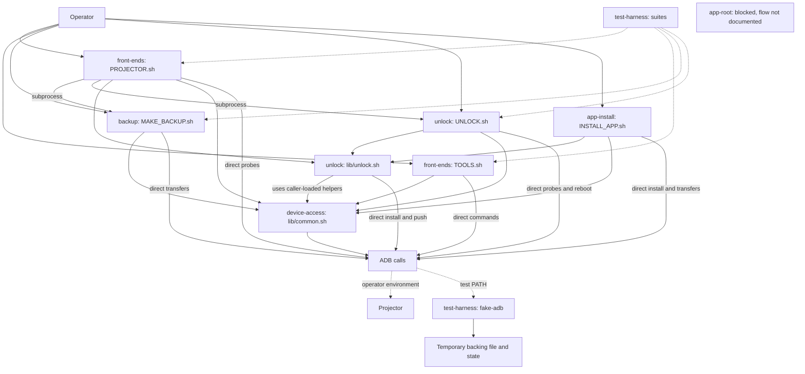

# System data flow

`scripts/PROJECTOR.sh::run_backup()` starts the backup CLI, while `run_unlock()`, `run_revert()` and `run_details()` start the unlock CLI. [verified] `TOOLS.sh` instead runs its own menu commands and sources the shared library; it is not another subprocess wrapper around those CLIs. [verified]

The entry scripts load `scripts/lib/common.sh`; PROJECTOR, UNLOCK and INSTALL_APP also load `scripts/lib/unlock.sh`. [verified] Shared helpers handle common device operations, but entry scripts also contain direct ADB calls, such as `scripts/UNLOCK.sh::check_supported_device()`. [verified]

## Whole-system flow

Solid arrows show calls or library use; dashed arrows show test driving and the selected ADB implementation. [verified]

The tests drive backup, unlock and front-end entry points, not `INSTALL_APP.sh`; their fake executable is selected by `PATH`, not an isolation boundary. [verified] The backup suite builds a sparse fixture through `tests/run-tests.sh::new_sandbox()`; the unlock and UI suites use `tests/device-emu/seed.sh`. [verified]

## Ownership of hops

| Hop | Owner | Evidence |
|---|---|---|
| Guided menu to backup or unlock subprocess | [front-ends](front-ends/README.md) | `scripts/PROJECTOR.sh::run_backup()` and `scripts/PROJECTOR.sh::run_unlock()`. [verified] |
| Capture to image and restore-script output | [backup](backup/README.md) | `scripts/MAKE_BACKUP.sh::create_restore_scripts()`. [verified] |
| Launcher step dispatch | [unlock](unlock/README.md) | `scripts/UNLOCK.sh::run_step()`. [verified] |
| APK install or removal | [app-install](app-install/README.md) | `scripts/INSTALL_APP.sh::main()`. [verified] |
| Shared root command transport | [device-access](device-access/README.md) | `scripts/lib/common.sh::adb_root_exec()`. [verified] |
| Script run to emulated device state | [test-harness](test-harness/README.md) | `tests/fake-adb/adb::run_remote()`. [verified] |

Every hop above has an owning block page in this tree. [verified] One device write escapes the two CLIs the diagram treats as the operation owners: `scripts/TOOLS.sh::reset_default_launcher()` calls `cmd package set-home-activity` itself instead of starting `scripts/UNLOCK.sh`, which is why the front ends carry a direct ADB arrow. [verified]
