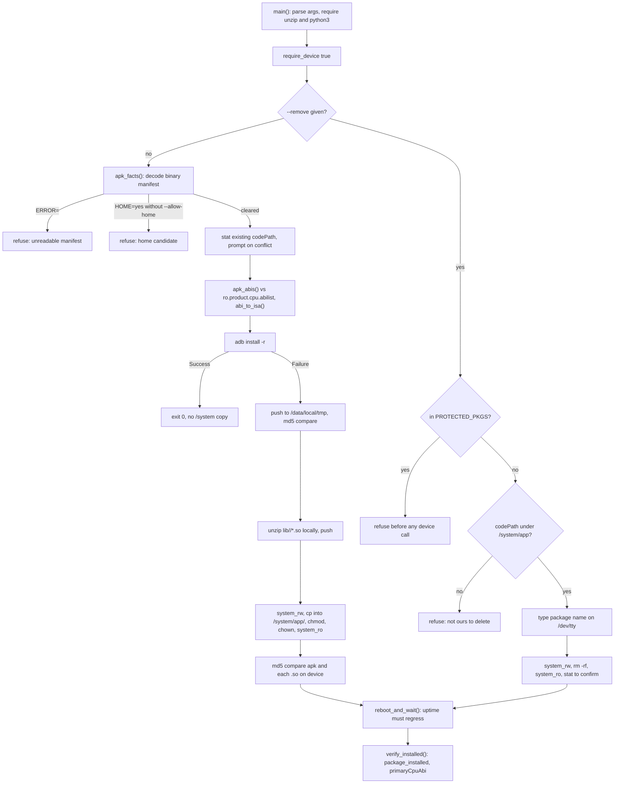

# App install

This block owns the one path by which an app reaches this projector: read the APK's binary manifest, refuse the class of APK that can stop the device booting, try a normal install, then fall back to copying the app into `/system/app` with its native libraries unpacked by hand. [verified] It also owns the reverse operation, a guarded delete of a directory this script placed under `/system/app`. [verified]

The narrative document `docs/INSTALL_LOCKED.md` records the reason the fallback exists: every normal install on this device fails with `INSTALL_FAILED_INVALID_INSTALL_LOCATION` inside the vendor's patched PackageManagerService, and everything present on the device sits in `/system/app`. [historical: 2026-07-30, docs/INSTALL_LOCKED.md] That document is narrative material owned by no block, so it is cited here and never edited from this page. [verified]

## Boundary

The block owns the APK to device decision: what is safe to install, where it lands, how it is named, and what is checked afterwards. [verified] It does not own how a root command reaches the device, nor how `/system` is remounted, nor how a launcher is chosen. [verified]

`scripts/INSTALL_APP.sh` loads both shared libraries at start and depends on them for every device call. [verified] Their mechanism is documented by the blocks that own those files, and this page records only what the dependency costs this block. [verified]

Installing an app is a `/system` change on this device, not a package operation, so the block's real surface is a directory layout plus a reboot, not an installer session. [inferred]

## Owned sources

| Source | Role | Evidence |
|---|---|---|
| `scripts/INSTALL_APP.sh` | The whole block: argument parsing in `main()`, the manifest gate in `apk_facts()`, ABI resolution in `apk_abis()` and `abi_to_isa()`, the install path in `install_app()`, the delete path in `remove_app()`, and post reboot checks in `reboot_and_wait()` and `verify_installed()`. | `[verified]` |

## Dependencies

| Block | Consequence | Evidence |
|---|---|---|
| [`device-access`](../device-access/README.md) | Every device write goes through `scripts/lib/common.sh::adb_root_exec()`, so this block inherits its refusals: a command containing a single quote is rejected rather than sent, and a call made before root is established returns without touching the device. `scripts/INSTALL_APP.sh::main()` calls `require_device true`, so the script exits before parsing anything when root is unavailable. | `[verified]` |
| [`unlock`](../unlock/README.md) | The `/system` write window is opened and closed by `scripts/lib/unlock.sh::system_rw()` and `scripts/lib/unlock.sh::system_ro()`, and registration is checked with `scripts/lib/unlock.sh::package_installed()`. A change to how that block remounts or reports mount state changes whether this block's copy step can write at all, with no code change here. | `[verified]` |
| [`unlock`](../unlock/README.md) | The two packages at the head of `scripts/INSTALL_APP.sh::PROTECTED_PKGS` are the same home dispatcher and stock launcher that block names in `scripts/lib/unlock.sh::HOME_DISPATCHER_COMP` and `scripts/lib/unlock.sh::STOCK_LAUNCHER`. The lists are separate copies of one fact, so renaming a package in one place leaves the other guarding nothing. | `[verified]` |

## Intra-block flow

