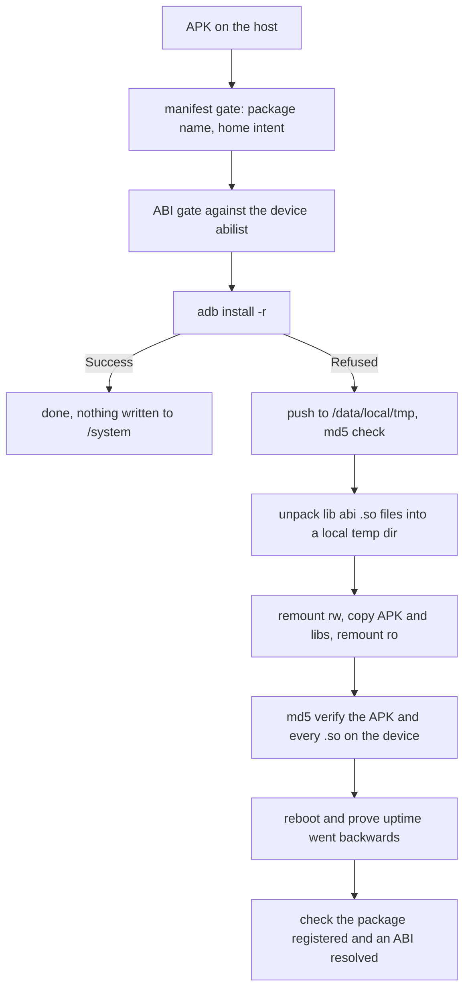

# App install

This block installs one APK on a device whose package manager answers
`INSTALL_FAILED_INVALID_INSTALL_LOCATION` to every normal install, by writing the
app into `/system/app` and rebooting so the package manager rescans it [verified].
It also owns the only supported way to remove such an app again, because an app
placed this way is a system app [verified].

The script is not a copy. Two steps make it more than that: a manifest gate that
refuses APKs which could take over the home intent, and unpacking the APK's
native libraries into the ISA directory the platform expects [verified].

## Boundary

This block owns argument parsing, the manifest and ABI gates, staging, the
`/system/app` layout, checksum verification, the reboot, the post-boot check and
removal [verified]. It owns no device transport and no remount logic of its own
[verified].

Everything about how a root command reaches the device, and everything about
making `/system` writable or querying the package database, stays in the two
blocks below [verified]. This page records only what those dependencies mean for
an install.

## Owned sources

| Source | Role | Evidence |
|---|---|---|
| `scripts/INSTALL_APP.sh` | Whole install, verify and remove flow for a single APK, plus its command line | [verified] |

## Dependencies

| Block | Consequence | Evidence |
|---|---|---|
| [device-access](../device-access/README.md) | Every device read and every write into `/system` goes through `scripts/lib/common.sh::adb_root_exec()`, so the install cannot start until `scripts/lib/common.sh::require_device()` has established root. Without it the script has no way to write outside `/data/local/tmp`. | [verified] |
| [unlock](../unlock/README.md) | `scripts/lib/unlock.sh::system_rw()` and `scripts/lib/unlock.sh::system_ro()` bracket the copy, and `scripts/lib/unlock.sh::package_installed()` is the post-boot registration check. A failed remount aborts the install before anything is written. | [verified] |

Setting the launcher default also lives in unlock, and the order between the two
matters. See the ordering contract in [CONTRACTS](CONTRACTS.md).

## Intra-block flow

