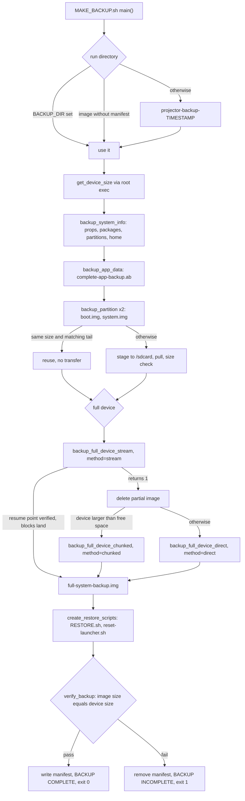

# Backup

This block owns `scripts/MAKE_BACKUP.sh`, the script that copies the projector's storage to the host and writes the restore scripts that sit beside the image. [verified] Its product is not a file that exists but a run directory that can be trusted: `scripts/UNLOCK.sh` runs `require_backup` for every mode except status, so a run that does not finish blocks the unlock CLI. [verified]

## Boundary

The block owns capture strategy selection and the three capture paths, partition capture and reuse, streaming resume arithmetic, the single pass/fail verdict, and the text of the generated `scripts/MAKE_BACKUP.sh::"RESTORE.sh"` and `scripts/MAKE_BACKUP.sh::"reset-launcher.sh"`. [verified]

It owns none of the transport underneath. ADB invocation, root escalation, the stall-killing stream reaper, the manifest writer and reader, the completeness check, the resumable-directory finder, and the size, md5 and human-size helpers all live in `scripts/lib/common.sh` and belong to [`device-access`](../device-access/README.md). [verified] Where this page states what one of those helpers means for a backup run, the mechanism is on that block's pages, not here.

The block also writes no log file. `scripts/MAKE_BACKUP.sh` prints progress to stdout and diagnostics to stderr, and the caller decides where that stream lands. [verified]

## Owned sources

| Source | Role | Evidence |
|---|---|---|
| `scripts/MAKE_BACKUP.sh` | The backup CLI: builds or resumes a run directory, captures system metadata, app data, two partitions and the whole block device by one of three strategies, generates the restore scripts, and decides in `scripts/MAKE_BACKUP.sh::verify_backup()` whether the run passed. | `[verified]` |

## Dependencies

| Block | Consequence | Evidence |
|---|---|---|
| [`device-access`](../device-access/README.md) | Root must already be established before any capture, a run directory stops being resumable the moment its manifest is written, and the durable success marker is produced by a helper this block does not own. | `[verified]` |

`scripts/MAKE_BACKUP.sh::main()` opens with `require_device true`, so an unrooted device ends the run before any capture starts. [verified] That is why `tests/run-tests.sh::"exits non-zero when root is unavailable"` never reaches a capture path. [verified]

Only `scripts/lib/common.sh::write_backup_manifest()` writes `scripts/MAKE_BACKUP.sh::"backup-manifest.txt"`, and only `scripts/MAKE_BACKUP.sh::verify_backup()` calls it. [verified] A directory holding an image but no manifest is what `scripts/lib/common.sh::find_incomplete_backup_dir()` offers back for resume, so writing the manifest is also what closes a run to further resumption. [verified]

Not every device call in this block goes through the shared root helpers. `scripts/MAKE_BACKUP.sh::backup_system_info()`, `scripts/MAKE_BACKUP.sh::backup_app_data()`, `scripts/MAKE_BACKUP.sh::get_device_free_space()` and every `adb pull` and cleanup `rm` use plain `adb` directly. [verified] The root helpers cover exactly the block-device and partition reads.

Consumers sit outside this block: [`front-ends`](../front-ends/README.md) starts the CLI as a subprocess in `scripts/PROJECTOR.sh::run_backup()` and captures its output into `scripts/PROJECTOR.sh::".backup-progress.log"`, and [`test-harness`](../test-harness/README.md) drives it through `tests/run-tests.sh::run_backup()`. [verified]

## Intra-block flow

