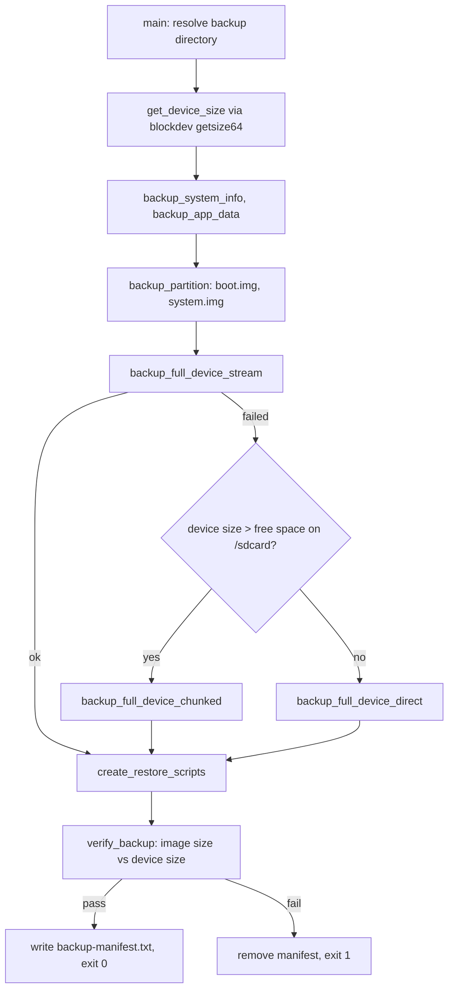

# Backup

This block captures a whole-device image from the projector over adb, captures a few narrower artifacts alongside it, and generates the restore path into the same directory. [verified]

It is the block that decides whether a backup counts as complete. Every other block that refuses to modify the device without a backup is reading the record this block writes. [verified]

## Boundary

The block owns one script. It owns the capture strategies, the resume logic, the size assertions, the tunables that shape a run, the generated `RESTORE.sh` text, and the decision to declare a run verified. [verified]

It does not own how a root command reaches the device, how a stalled transfer is detected and killed, how a local or remote file size is measured, or how the manifest file is written and read back. Those live in `scripts/lib/common.sh`, which belongs to [device-access](../device-access/README.md). [verified]

Restoring is only partly in scope. This block owns the text of the restore script it emits, but running a restore is a human action against the device and nothing here executes one. [verified]

## Owned sources

| Source | Role | Evidence |
|---|---|---|
| `scripts/MAKE_BACKUP.sh` | Whole-device capture, partition and system-info capture, restore script generation, and the single pass/fail verdict for a run | `[verified]` |

## Dependencies

| Block | Consequence | Evidence |
|---|---|---|
| [device-access](../device-access/README.md) | The script sources `scripts/lib/common.sh` at startup and cannot run without it. Root execution, stall-watched transfers, size probes and the manifest format come from there, so a change in that library changes how a backup is captured and what counts as verified without this block's owned file being touched. | `[verified]` |

## Intra-block flow

