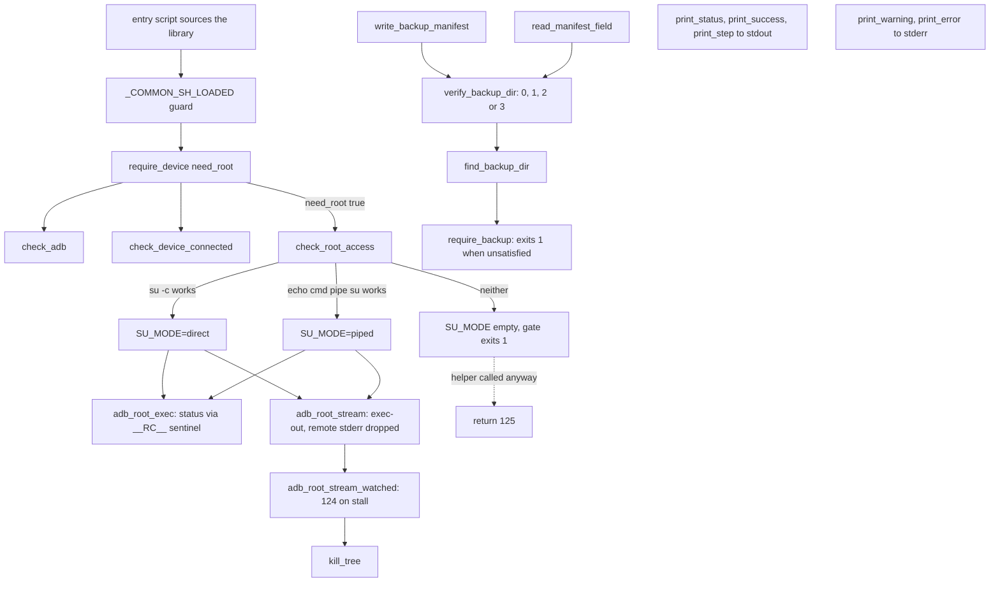

# Device access

`scripts/lib/common.sh` is the shared library every entry script loads before it touches the projector. [verified] It owns operator output routing, the ADB preflight gates, the root handshake, the two root transports, the stall watchdog, the backup manifest format and its verification, the confirmation prompts, and the local size and checksum utilities. [verified]

## Boundary

The block owns one file. [verified] The library defines functions, a few constants and the mutable global `scripts/lib/common.sh::SU_MODE`; it is never run as a program, so everything here executes inside a caller's shell process. [verified]

Sharing a library is not interception. Entry scripts also issue ADB commands directly, and such a command gets none of the root wrapping, stderr suppression or exit-status recovery described on these pages. [verified] Those direct calls belong to the blocks that write them, not here. [verified]

`scripts/lib/unlock.sh` is a separate library owned by [`unlock`](../unlock/README.md), even though it runs against helpers this block defines and its caller loaded. [verified]

## Owned sources

| Source | Role | Evidence |
|---|---|---|
| `scripts/lib/common.sh` | The one shared library: print helpers, `scripts/lib/common.sh::require_device()` preflight, the `SU_MODE` root handshake, `adb_root_exec()` and `adb_root_stream()` transports, the `adb_root_stream_watched()` watchdog with `kill_tree()`, the backup manifest and verification helpers, prompts, and size and checksum utilities. | `[verified]` |

## Dependencies

The block has no dependencies. `scripts/lib/common.sh` sources no other file and calls no script at the pin, confirmed by reading the whole file. [verified] The include guard `scripts/lib/common.sh::_COMMON_SH_LOADED` means a second load is a no-op rather than a redefinition. [verified]

## Consumers

Each row records what the consumer gets from this block, not how the consumer works. [verified]

| Block | Consequence | Evidence |
|---|---|---|
| [`backup`](../backup/README.md) | Loads the library and drives the bulk path: `scripts/MAKE_BACKUP.sh` is the only caller of `scripts/lib/common.sh::adb_root_stream_watched()` and it chooses the stall timeout per call. | `[verified]` |
| [`unlock`](../unlock/README.md) | Uses `scripts/lib/common.sh::require_backup()` as its gate before destructive work, so a backup that fails verification here stops an unlock there. | `[verified]` |
| [`app-install`](../app-install/README.md) | Re-probes root after a reboot through `scripts/lib/common.sh::check_root_access()` and sends root commands through `adb_root_exec()`. | `[verified]` |
| [`front-ends`](../front-ends/README.md) | Draws menu state from this block's read-only helpers, including `scripts/lib/common.sh::verify_backup_dir()` and `check_root_access()`, and uses `pause()` for its prompts. | `[verified]` |
| [`test-harness`](../test-harness/README.md) | Sources the library directly to assert on its load behaviour, diagnostic routing, size formatting and backup gate. | `[verified]` |

`SU_MODE` is never exported, confirmed by the absence of any `export` in the library. [verified] A front end that starts a backup as a subprocess therefore hands over no root state, and the child probes again in its own process. [inferred]

## Intra-block flow

