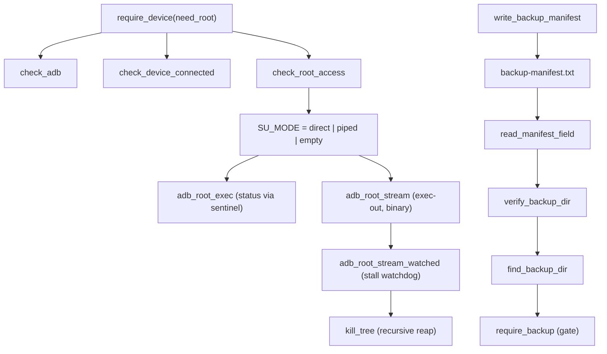

# Device access

This block is the shared bottom layer of the toolkit. It owns the one bash library that every entry script sources, and it defines how a command reaches the projector, how bulk data comes back, and what counts as a verified backup. [verified]

## Boundary

The block owns the mechanism of talking to the device: the root probe, the two exec helpers, the two streaming helpers, the process reaper, and the local size and hash utilities. [verified]

It also owns the `backup-manifest.txt` format, because the code that writes it and the code that refuses a destructive operation without it both live here. [verified]

It does not own any workflow. Choosing partitions, chunking, resume offsets and restore live in the backup block, and the launcher and settings work lives in the unlock block, both of which source this library rather than reimplementing it. [verified]

It does not own the stand-in device used by the tests. `tests/fake-adb/adb` belongs to the test harness block and is cited here only as evidence about the real hardware. [verified]

## Owned sources

| Source | Role | Evidence |
|---|---|---|
| `scripts/lib/common.sh` | Shared library sourced by all five entry scripts: printing, device and root guard, root exec and stream helpers, backup directory resolvers, manifest read and write, local size and hash utilities. | `[verified]` |

## Dependencies

This block has no dependencies. It is sourced by every other script block and sources nothing itself, so `depends_on` is empty. [verified]

Five consumers source it at the pin: `scripts/INSTALL_APP.sh`, `scripts/MAKE_BACKUP.sh`, `scripts/PROJECTOR.sh`, `scripts/TOOLS.sh` and `scripts/UNLOCK.sh`. [verified]

## Intra-block flow

