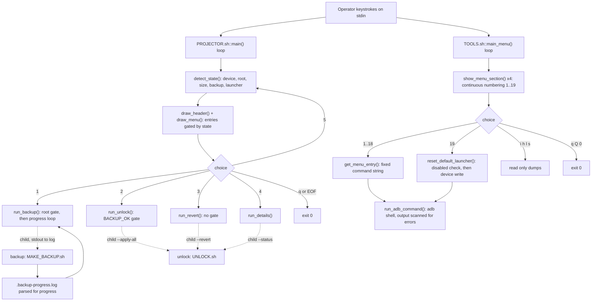

# Front ends

The two interactive terminal programs an operator actually types into: `scripts/PROJECTOR.sh`, a guided workflow that walks one path from device detection to an unlocked launcher, and `scripts/TOOLS.sh`, a flat catalogue of screens to open on the device. [verified]

## Boundary

This block owns what an operator sees and what a keystroke selects: menu text, menu order, entry numbering, the dispatch from a typed character to an action, the gating that decides whether an entry is offered, and the exit paths. [verified] It owns almost no device mechanism. `scripts/PROJECTOR.sh` runs `scripts/MAKE_BACKUP.sh` and `scripts/UNLOCK.sh` as subprocesses instead of reimplementing them, and its header comment records the reason: a second copy of the backup logic behind a nicer screen would be a second place for it to be quietly wrong. [verified]

There is one exception, and it is the important one. `scripts/TOOLS.sh::reset_default_launcher()` changes which launcher the device boots into using its own `cmd package set-home-activity` call, not by dispatching into the unlock block. [verified] That write is described in [Contracts](CONTRACTS.md) and its missing confirmation is the first entry in [Gaps](GAPS.md). [verified]

Presentation primitives (`print_error`, `print_success`, `pause`, the colour constants) and every ADB or root probe belong to [`device-access`](../device-access/README.md); this block calls them and does not define them. [verified]

## Owned sources

| Source | Role | Evidence |
|---|---|---|
| `scripts/PROJECTOR.sh` | Guided workflow. Refreshes device, backup and launcher state on every loop, draws a status header, offers five numbered actions, and dispatches four of them into the backup and unlock CLIs. | `[verified]` |
| `scripts/TOOLS.sh` | Settings menu. Renders 19 numbered entries across four sections plus four letter keyed diagnostics, and sends a fixed `adb shell` command string for the entry selected. | `[verified]` |

Both scripts resolve their own directory from `BASH_SOURCE` and source `scripts/lib/common.sh`; `scripts/PROJECTOR.sh` additionally sources `scripts/lib/unlock.sh` after setting `APK_DIR`. [verified]

## Dependencies

| Block | Consequence | Evidence |
|---|---|---|
| [`device-access`](../device-access/README.md) | Both front ends are drawn with that block's printing helpers and blocked by its device checks, so a change to `scripts/lib/common.sh::require_device()` changes whether a menu is reached at all. `scripts/TOOLS.sh::main()` passes `false`, so it never demands root; `scripts/PROJECTOR.sh::detect_state()` calls `scripts/lib/common.sh::check_root_access()` and degrades its own header rather than exiting. | `[verified]` |
| [`backup`](../backup/README.md) | `scripts/PROJECTOR.sh::run_backup()` starts that block as a child process and then reads its log text to draw a progress bar, so the wording of the backup block's progress lines is load bearing here. It also discovers existing backups by globbing `projector-backup-*` and validating them with that block's verifier. | `[verified]` |
| [`unlock`](../unlock/README.md) | `scripts/PROJECTOR.sh` both links that block's library (for `scripts/lib/unlock.sh::launcher_default_state()` and `scripts/lib/unlock.sh::home_activity()` in the header) and runs its CLI as a child for apply, revert and status. Every yes or no confirmation an operator answers during an unlock is printed by that block, not this one. | `[verified]` |

`scripts/TOOLS.sh` depends only on `device-access` at the pin: it never sources `scripts/lib/unlock.sh` and never starts another toolkit script, though it does print `scripts/TOOLS.sh::"UNLOCK.sh --revert"` as advice. [verified]

## Intra-block flow

Solid arrows are in process calls, dashed arrows are child processes handed to another block. [verified]

