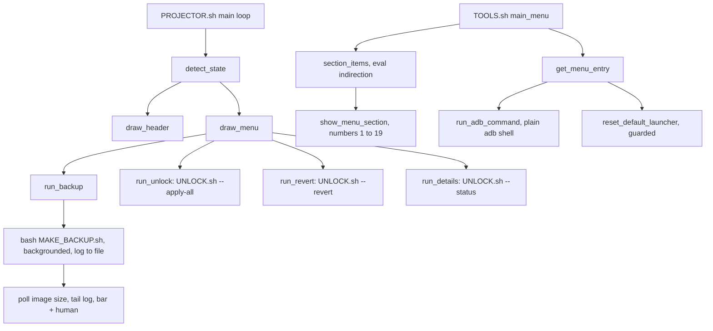

# Front ends

Two interactive terminal programs. `scripts/PROJECTOR.sh` is the guided entry point over the whole toolkit, and `scripts/TOOLS.sh` opens hidden settings screens on the device. [verified]

## Boundary

This block owns screens, state rendering and dispatch. It decides what an owner is shown, in what order, and which other script runs when a key is pressed. [verified]

`scripts/PROJECTOR.sh` changes nothing on the device itself. It reads state through the shared library and the unlock library, then runs `scripts/MAKE_BACKUP.sh` and `scripts/UNLOCK.sh` as separate bash processes for every action that writes. [verified]

`scripts/TOOLS.sh` is the exception to that. It issues its own plain `adb shell` commands to open activities, read diagnostics, and in one entry hand the home screen back, all as the shell user with no root. Those commands exist nowhere else in the toolkit, so this block owns them. [verified]

Not owned here: the root probe and the exec and stream helpers, the unlock steps and their state strings, the image chunking, resume and verification, and the fake adb plus the regression tests. Each is described by its owning block and only its consequence is recorded here. [verified]

## Owned sources

| Source | Role | Evidence |
|---|---|---|
| `scripts/PROJECTOR.sh` | Guided front end: device, backup and launcher state in a header, a five key menu, a live backup progress screen, and delegation to the backup and unlock scripts. | [verified] |
| `scripts/TOOLS.sh` | Hidden settings front end: four menu arrays of device commands numbered 1 to 19, four lettered diagnostics, and a guarded launcher reset. | [verified] |

## Dependencies

| Block | Consequence | Evidence |
|---|---|---|
| [`device-access`](../device-access/README.md) | Both scripts source `scripts/lib/common.sh` and have no device access of their own. `scripts/TOOLS.sh` gets its startup guard from `scripts/lib/common.sh::require_device()`, and `scripts/PROJECTOR.sh` gets the root probe, the root exec helper, `local_size` and `verify_backup_dir`. A root read only works after the probe has set the su mode. | [verified] |
| [`unlock`](../unlock/README.md) | `scripts/PROJECTOR.sh` sources `scripts/lib/unlock.sh` for read only state and shells out to `scripts/UNLOCK.sh` for every change. The header wording follows that block's state strings, and that block's own gates still apply, so a revert driven from the menu still needs a verified backup. | [verified] |
| [`backup`](../backup/README.md) | `run_backup` shells out to `scripts/MAKE_BACKUP.sh`. Chunking, resume, stall handling and size verification belong there. The front end only polls the image size and greps the log for the completion line. | [verified] |

The regression tests for both front ends live in the [`test-harness`](../test-harness/README.md) block, in `tests/ui-tests.sh`. They run each script through `/bin/bash` against a fake adb, so they are the enforcement cited throughout these pages. [verified]

## Intra-block flow

