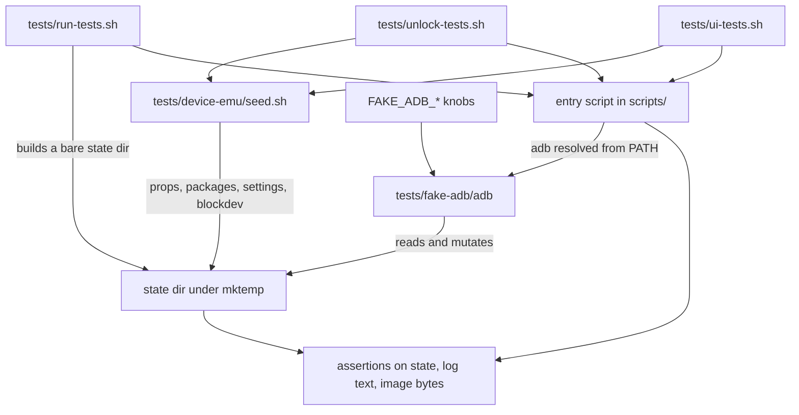

# Test harness

The block holds everything that lets the toolkit be exercised without the projector: a stand-in `adb`, a seeded device fixture, and three suites that drive the real entry scripts against them. [verified]

## Boundary

This block owns the emulation and the assertions, never the behaviour being asserted. [verified] The scripts under test live in `scripts/` and belong to the `backup`, `unlock`, `front-ends` and `device-access` blocks, so the mechanism of a backup or an unlock is documented there and only its observable result is documented here. [verified]

The harness models a command vocabulary, not Android: `tests/fake-adb/adb::run_remote()` answers the exact command strings the toolkit sends and anything else falls through to `tests/fake-adb/adb::"unhandled remote command"` with status 127. [verified]

## Owned sources

| Source | Role | Evidence |
|---|---|---|
| `tests/fake-adb/adb` | Stand-in `adb` binary: dispatches remote commands, emulates `dd` against a backing file, and holds all failure injection. | `[verified]` |
| `tests/device-emu/seed.sh` | Builds a device state directory from values recorded off the real projector. | `[verified]` |
| `tests/run-tests.sh` | Drives `scripts/MAKE_BACKUP.sh` and the `scripts/lib/common.sh` helpers. | `[verified]` |
| `tests/unlock-tests.sh` | Drives `scripts/UNLOCK.sh` end to end against the seeded fixture. | `[verified]` |
| `tests/ui-tests.sh` | Drives the two interactive front ends, `scripts/TOOLS.sh` and `scripts/PROJECTOR.sh`. | `[verified]` |

## Dependencies

| Block | Consequence | Evidence |
|---|---|---|
| [`device-access`](../device-access/README.md) | The harness reproduces the root and transport shapes that block relies on, so a change to how a command is wrapped in `su` turns into an unhandled command here rather than a device answer. | `[verified]` |
| [`backup`](../backup/README.md) | `tests/run-tests.sh::run_backup()` asserts against the run directory, log and manifest that block produces, including the literal `method=` line. | `[verified]` |
| [`unlock`](../unlock/README.md) | `tests/unlock-tests.sh` asserts on operator-facing message text, so rewording a refusal breaks the suite without changing behaviour. | `[verified]` |
| [`front-ends`](../front-ends/README.md) | `tests/ui-tests.sh` drives the menus by feeding keystrokes on stdin and matches rendered entry numbers, so it is coupled to menu order. | `[verified]` |

## Intra-block flow

