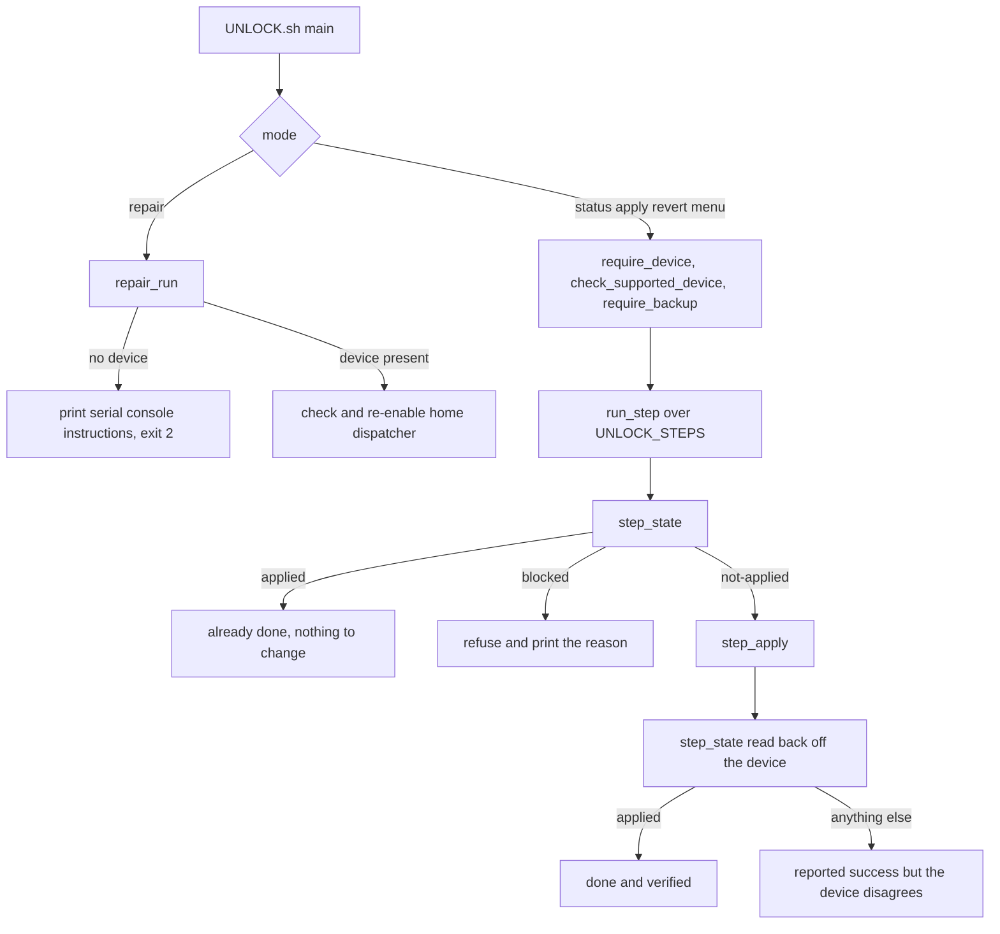

# Unlock

This block makes a chosen launcher the home screen on a Newlink NL5H00X projector, and repairs a projector whose home intent has no candidate left to answer it. [verified]

It is the highest risk block in the toolkit. The firmware dispatches home as MAIN plus HOME plus CATEGORY_SETUP_WIZARD, so the component that declares SETUP_WIZARD wins the intent and then starts the stock launcher by explicit name. [verified] Removing that component leaves the intent with zero candidates and the projector stops booting. [historical: recorded in scripts/lib/unlock.sh, three days and a soldered UART console to undo]

## Boundary

The block owns the four step functions that change the device and the command line tool that drives them. [verified] It owns the queries those steps use to ask the device what it currently does, the two helpers that remount the filesystem holding /system, and the repair mode. [verified]

It does not own adb, root establishment, or backup verification. Those live in `device-access` and this page records only their consequence. [verified] It does not own the emulator or the test suite that exercises it; those tests are cited here as enforcement but belong to the test harness. [verified]

## Owned sources

| Source | Role | Evidence |
|---|---|---|
| `scripts/UNLOCK.sh` | Command line entry point, hardware and backup gates, step driver, interactive menu | [verified] |
| `scripts/lib/unlock.sh` | Step library, device queries, remount helpers, repair mode | [verified] |

## Dependencies

| Block | Consequence | Evidence |
|---|---|---|
| [`device-access`](../device-access/README.md) | No step in this block can read or write the device until root is established, and the precondition gates exit the process rather than returning | [verified] |

Two consequences matter enough to state here. Every device call in this block goes through `scripts/lib/common.sh::adb_root_exec()`, which refuses to run anything before root is established. [verified] Most call sites in this block send its stderr to /dev/null, so that refusal arrives as an empty answer, which reads exactly like a device reporting that nothing is wrong. [verified] That is why `scripts/lib/unlock.sh::repair_run()` establishes root before it believes any answer about a disabled component. [verified]

The second is that `scripts/lib/common.sh::require_device()` and `scripts/lib/common.sh::require_backup()` call `exit` on failure. [verified] A caller cannot recover from them, which is why `--repair` is dispatched before either of them runs. [verified]

## Intra-block flow

