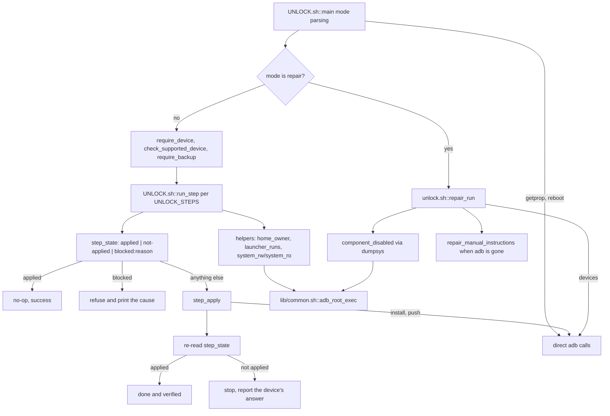

# Unlock

This block replaces the projector's home screen. It holds the step library that defines what a change is and how it is proven, the launcher preference management that is the point of the whole toolkit, and the repair CLI for a device that no longer boots. [verified]

## Boundary

The block owns two files: a library of unlock steps and the command line that drives them. [verified] It does not own the shared ADB and root transport, the backup it refuses to run without, the APK payloads it installs, or the tests that assert on its output. [verified]

The library is not private to its own CLI. `scripts/PROJECTOR.sh` and `scripts/INSTALL_APP.sh` both source `scripts/lib/unlock.sh` at the pin, the latter for `scripts/lib/unlock.sh::system_rw()`, `scripts/lib/unlock.sh::system_ro()` and `scripts/lib/unlock.sh::package_installed()` by its own source comment. [verified] So a change to a helper in this file reaches two entry scripts owned by other blocks. [inferred]

Most device traffic in this block goes through the shared root helper, but not all of it. Four call sites use `adb` directly: `scripts/UNLOCK.sh::check_supported_device()` reads two properties with plain `adb shell getprop`, `scripts/UNLOCK.sh::interactive()` runs `adb reboot` from its menu, `scripts/lib/unlock.sh::launcher_present_apply()` runs `adb install` and `adb push`, and `scripts/lib/unlock.sh::repair_run()` probes with `adb devices`. [verified] Every other device call in the two files is `scripts/lib/common.sh::adb_root_exec()`, 33 call sites in the library and none in the CLI, counted at the pin as non-comment lines naming it. [verified]

## Owned sources

| Source | Role | Evidence |
|---|---|---|
| `scripts/lib/unlock.sh` | Step library: four steps of four functions each, the launcher and home-intent helpers, the `/system` remount pair, and the repair routine. | `[verified]` |
| `scripts/UNLOCK.sh` | Command line: device and backup preconditions, step dispatch, status table, revert, interactive menu, and the repair mode that runs before any precondition. | `[verified]` |

## Dependencies

| Block | Consequence | Evidence |
|---|---|---|
| [`device-access`](../device-access/README.md) | The library reaches the device almost entirely through `scripts/lib/common.sh::adb_root_exec()`, so how a command is wrapped for root, and what that helper returns when root is not established, decides what every state function here reads back. `scripts/lib/unlock.sh::repair_run()` calls `scripts/lib/common.sh::require_device()` for exactly that reason, recorded in its own comment: without root the helper answers with silence, which reads like "nothing is disabled". | `[verified]` |
| [`device-access`](../device-access/README.md) | `scripts/UNLOCK.sh::main()` gates every non-repair mode except `--status` on `scripts/lib/common.sh::require_backup()`, and the refusal text that `tests/unlock-tests.sh::"applying without a backup is refused"` matches is produced there, not here. | `[verified]` |
| [`device-access`](../device-access/README.md) | All operator output uses the shared `print_*` helpers, so their stream routing decides whether a caller capturing one stream sees a refusal. | `[verified]` |

`scripts/INSTALL_APP.sh` and `scripts/PROJECTOR.sh` consume this block rather than being consumed by it; see [`app-install`](../app-install/README.md) and [`front-ends`](../front-ends/README.md). [verified] The suite that pins this block's message wording is described in [`test-harness`](../test-harness/README.md). [verified]

## Intra-block flow

